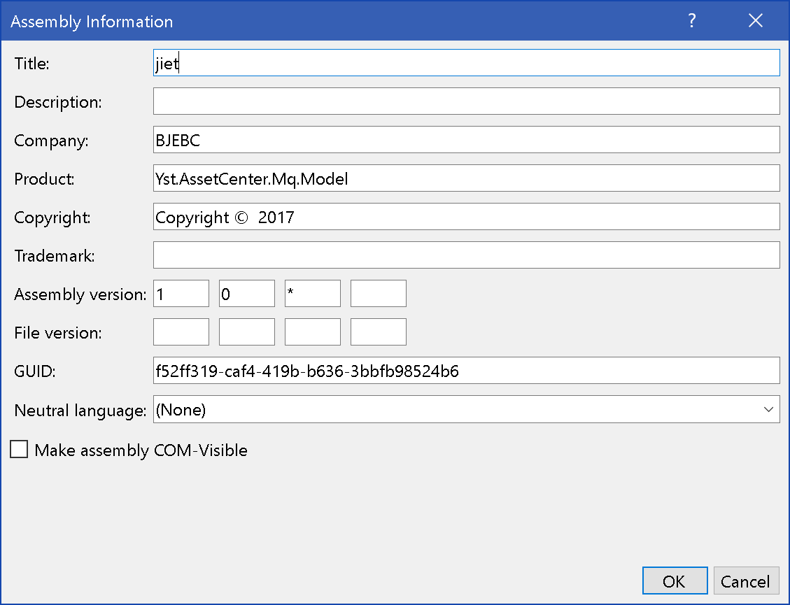

通用类库向nuget迁移可以提高代码的复用效率，实现通用类库的版本控制，减轻持续集成与持续发布的编译负担。在中，介绍了一种轻量级Nuget服务。本文将从**nuget.exe**客户端入手，实现依赖项的打包与发布。

## Nuget Package的生成

### Nuget GUI管理工具
查看、管理Nuget包最直接的方式就是通过[NuGet Package Explorer](https://github.com/NuGetPackageExplorer/NuGetPackageExplorer)这个GUI工具，通过它可以直观的查看Package相关属性及内容，非常适合查看和调整已有的包。但是**Package的内容有非常严格的目录层级及用途，若要灵活使用此工具需要[在这里]()详细了解相关特性。**因此其不利于Package的自动化生成与发布。


### 通过\*.nuspec声明文件进行配置
``` powershell
nuget pack <project-name>.nuspec
```

实现自定义包还可通过*.nuspec的XML结构的配置文件实现：
``` xml
<?xml version="1.0"?>
<package xmlns="http://schemas.microsoft.com/packaging/2013/05/nuspec.xsd">
    <metadata>
    <!-- The identifier that must be unique within the hosting gallery -->
    <id>Contoso.Utility.UsefulStuff</id>
    <!-- The package version number that is used when resolving dependencies -->
    <version>1.8.3-beta</version>
    <!-- Authors contain text that appears directly on the gallery -->
    <authors>Dejana Tesic, Rajeev Dey</authors>
    <!-- Owners are typically nuget.org identities that allow gallery
            users to easily find other packages by the same owners.  -->
    <owners>dejanatc, rjdey</owners>
    <!-- License and project URLs provide links for the gallery -->
    <licenseUrl>http://opensource.org/licenses/MS-PL</licenseUrl>
    <projectUrl>http://github.com/contoso/UsefulStuff</projectUrl>
    <!-- The icon is used in Visual Studio's package manager UI -->
    <iconUrl>http://github.com/contoso/UsefulStuff/nuget_icon.png</iconUrl>
    <!-- If true, this value prompts the user to accept the license when
            installing the package. -->
    <requireLicenseAcceptance>false</requireLicenseAcceptance>
    <!-- Any details about this particular release -->
    <releaseNotes>Bug fixes and performance improvements</releaseNotes>
    <!-- The description can be used in package manager UI. Note that the
            nuget.org gallery uses information you add in the portal. -->
    <description>Core utility functions for web applications</description>
    <!-- Copyright information -->
    <copyright>Copyright ©2016 Contoso Corporation</copyright>
    <!-- Tags appear in the gallery and can be used for tag searches -->
    <tags>web utility http json url parsing</tags>
    <!-- Dependencies are automatically installed when the package is installed -->
    <dependencies>
        <dependency id="Newtonsoft.Json" version="9.0" />
    </dependencies>
    </metadata>
    <!-- A readme.txt to display when the package is installed -->
    <files>
        <file src="readme.txt" target="" />
    </files>
</package>
```
这种通过声明文件配置包的方式依然存在门槛，对文件中元数据的键值对进行配置繁琐，并且难以维护。详情可参阅[创建nuspec文件](https://docs.microsoft.com/en-us/nuget/create-packages/creating-a-package?#creating-the-nuspec-file)。
### 通过\*.csproj工程文件进行配置
``` powershell
nuget pack <project-name>.csproj
```
通过这种方式我们可以轻松的将现有工程转换为对应的*.nupkg包。
在使用这种方式对目标工程进行打包前，需要注意以下几点：
* 需要修改工程的*Assembly Infomation*，其中Company是比较重要的一项，填入的信息将被**nuget.exe**作为*Author*的包属性使用。


* 比较通用的版本号标识方法为**Major.Minor.Build.Revision**
    * Major：具有相同名称但不同主版本号的程序集不可互换。例如，这适用于对产品的大量重写，这些重写使得无法实现向后兼容性。当有极大的更新时，会增加major的版号。**Major主版本号一般不向下兼容。**
    * Minor：如果两个程序集的名称和主版本号相同，而次版本号不同，这指示显著增强，但照顾到了向后兼容性。例如，这适用于产品的修正版或完全向后兼容的新版本。而当有大更新，但不至于更新major时，会更新minor的版号。**当主板本号相同，Minor次版本号不同，高版本一般需要对低版本进行兼容。**
    * Build：内部版本号的不同表示对相同源所作的重新编译。这适合于更改处理器、平台或编译器的情况。若更新比较小，例如只是除虫（bug fixing），则会更新build的版号。
    * Revision：名称、主版本号和次版本号都相同但修订号不同的程序集应是完全可互换的。这适用于修复以前发布的程序集中的安全漏洞。程序集的只有内部版本号或修订号不同的后续版本被认为是先前版本的修补程序 (Hotfix) 更新。当在同一个Build下需要重新编译，那么就需要增加Revision即可。
上面的Assembly Infomation图中Build版本号处填写的为**\***，表示由此位开始，Build版本号及Revision版本号将由机器根据时间自动生成，以对之前的版本进行区分。
* 打包过程将直接对编译结果进行处理，因此在打包前需要手动进行编译。否则**nuget.exe**会报错。
用来调整打包内容的选项如下：

|参数|说明|
|---|---|
|IncludeReferencedProjects|解决方案的依赖项将以递归的方式被加入到Package中。|
|properties|键值对，例如：-properties Configuration=Release|
|symbols|添加此选项会将调试使用的符号文件添加至Package中。推荐Beta版本的Package使用Debug编译方式，并将符号文件进行附加。|

## Nuget Package的发布
使用Nuget.Server作为Nuget服务器时，可以通过两种方式将自定义包进行发布。

### 直接发布至指定目录
Nuget.Server的配置文件web.confg下AppSetting节点中对保存包的物理路径进行了设置。将打包好的*.nupkg复制至此文件夹即完成打包。
### 通过nuget cli进行推送
``` powershell
nuget.exe push {package file} {apikey} -Source http://NugetServer/nuget
```
