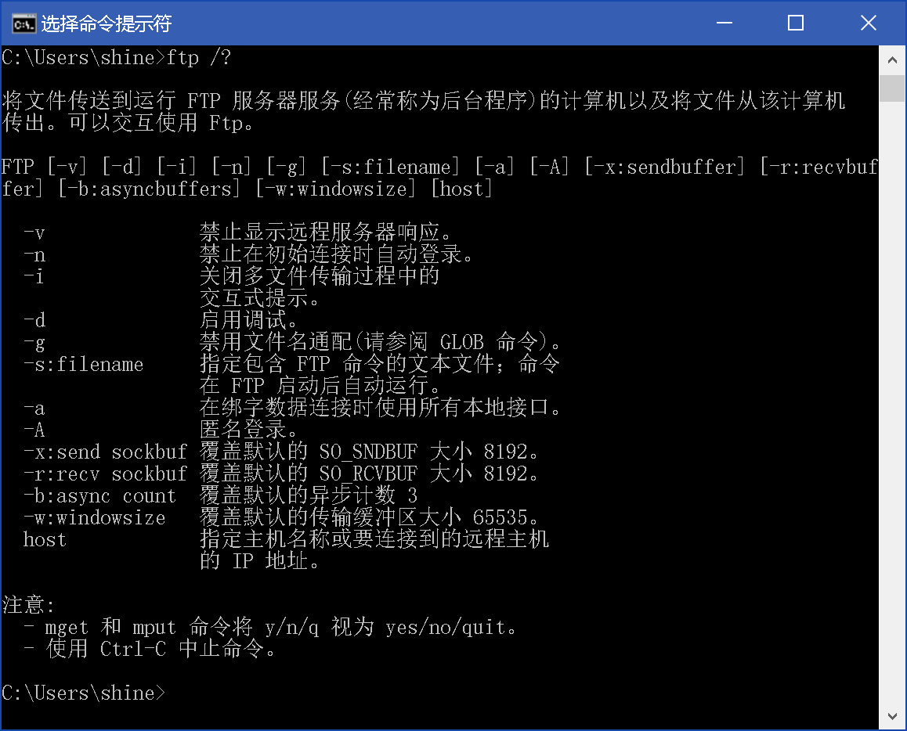
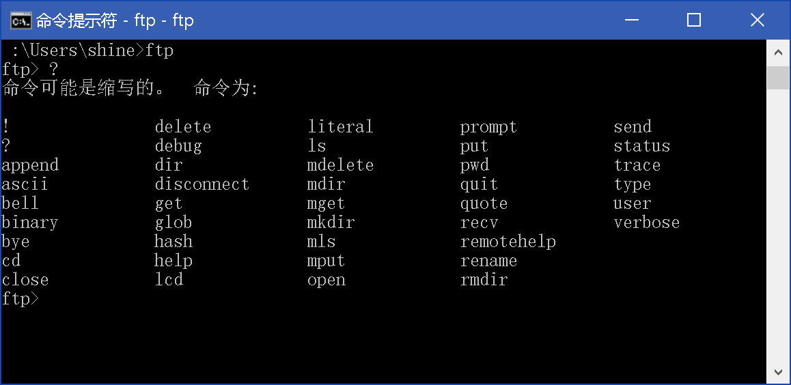

## FTP服务的建立
在Windows系统下建立IIS服务，除了使用IIS外还可以使用[Filezilla工具](https://filezilla-project.org/)，此工具除了会安装windows服务外，还会提供一个对服务进行管理的桌面应用。管理工具默认通过14147端口与服务进行通信。

## FTP命令行工具
### 参考地址
[Windows XP Pro 文档](https://www.microsoft.com/resources/documentation/windows/xp/all/proddocs/en-us/ftp.mspx?mfr=true)

### 语法
ftp [-v] [-d] [-i] [-n] [-g] [-s:FileName] [-a] [-w:WindowSize] [-A] [Host]

### 参数说明：
|参数|说明|
|---|---|
|/?|显示帮助。|
|-v|隐藏FTP服务器的的回复信息。|
|-d|启动调试，显示所有FTP客户端与服务器之间的命令。|
|-s:*FileName*|指定一个包括FTP命令的文本文件，文件中的命令会在ftp命令执行时逐个调用。参数中不能包含空格。可以使用此参数代替流重定向**(<)**。|
|Host|指定FTP的服务器的计算机名、IP地址。此参数可选且必须作为最后一个参数。|


### 子命令
启动ftp工具后，会进入ftp的命令行界面，这是输入*?*会显示命令的提示：


|参数|说明|
|---|---|
|?|显示所有子命令|
|open *Host*|与目标服务器建立连接|
|close|关闭连接|
|quit|退出ftp工具不显示提示信息|
|!|退出ftp工具显示版本号等信息|
|cd|切换服务端工作目录|
|lcd|切换本地工作目录|
|put|上传本地文件至服务器|
|mput|批量上传本地文件至服务器|
|delete|删除服务器中的文件|
|mdelete|批量删除服务器中的文件|
|status|显示当前的链接状态|
|prompt|开关交互模式。关闭此模式命令成功执行时不会显示提示信息。|

### 自动化脚本举例
FTP命令：
``` cmd
ftp -s:upload.src 10.20.30.40
```
upload.src：
``` plain
user
pass
lcd bin
cd _api/bin
mdel *
mput *
quit
```

|脚本|说明|
|---|---|
|user|ftp用户名|
|pass|ftp密码|
|lcd|切换至本地bin目录|
|cd api/bin|切换服务端目录为api/bin文件夹
|mdel *|删除服务端当前工作目录的所有文件（不包括文件夹）|
|mput *|上传本地工作目录的所有文件至服务器（不包括文件夹）|
|quit|关闭ftp工具|

## FTP的主动模式与被动模式
在部署Jenkins使用Filezilla服务持续发布过程中出现上述提示。现象为FTP可以连接、登陆。但使用命令查询、上传、下载文件时客户端卡住，服务端报425错误。
``` plain
You appear to be behind a NAT router. Please configure the passive mode settings and forward a range of ports in your router.
(000156)2017/12/15 11:14:43 - shine (10.134.251.51)> LIST
(000156)2017/12/15 11:14:43 - shine (10.134.251.51)> 150 Opening data channel for directory listing of "/"
(000156)2017/12/15 11:14:53 - shine (10.134.251.51)> 425 Can't open data connection for transfer of "/"
```
要想解决此问题需要了解ftp协议的主动模式和被动模式。
### 主动模式
以服务器端防火墙为立足点，要支持主动模式FTP需要打开如下交互中使用到的端口：
1. FTP服务器命令（21）端口接受客户端任意端口（客户端初始连接）
1. FTP服务器命令（21）端口到客户端端口（>1023）（服务器响应客户端命令）
1. FTP服务器数据（20）端口到客户端端口（>1023）（服务器初始化数据连接到客户端数据端口）
1. FTP服务器数据（20）端口接受客户端端口（>1023）（客户端发送ACK包到服务器的数据端口）

小结：主动模式是客户端与服务端建立命令链接后，服务端会尝试与客户端建立数据连接。

### 被动模式
对于服务器端的防火墙来说，必须允许下面的通讯才能支持被动方式的FTP:
1. FTP服务器命令（21）端口接受客户端任意端口（客户端初始连接）
1. FTP服务器命令（21）端口到客户端端口（>1023）（服务器响应客户端命令）
1. FTP服务器数据端口（>1023）接受客户端端口（>1023）（客户端初始化数据连接到服务器指定的任意端口）
1. FTP服务器数据端口（>1023）到客户端端口（>1023）（服务器发送ACK响应和数据到客户端的数据端口）

小结：被动模式是客户端与服务端建立命令链接后，服务端会开放数据端口并将相关信息通过命令链接发送给客户端，客户端通过得到的信息与服务端建立数据链接。

Tips：
* 主动模式和被动模式都是相对于服务端而言，服务端尝试与客户端建立数据链接就是主动，服务端打开端口等待客户端去链接就是被动。
* 被动模式的产生原因是因为服务端与位于NAT网络（客户端IP地址非公网IP）时产生的需求。服务端尝试与客户端建立连接

### 错误425
此情景下425问题的产生是主动模式下客户端与服务端建立命令链接后，客户端将命令发布至服务端，服务端响应命令，并尝试与客户端建立数据链接是故障产生的。由于数据链接未建立，客户端会持续的等待直至手动停止或超时。由于数据链接建立在客户端的高位随机端口，因此无法开放防火墙的特定端口解决此问题，临时的解决方案为**临时关闭客户端的防火墙**。因为客户端与服务端同在专用内网，经过权衡无伤大雅。**请勿滥用此临时方案。**

## 小结
* Windows下的ftp工具不能很好的支持被动模式，否则可以通过被动模式与服务器建立连接。（Filezilla可以限定被动模式的端口使用范围，防火墙仅开放对应端口即可，无需完全开放。）
* 使用虚拟主机建站的年代，是FTP工具使用最广泛的时期。用来建站的虚拟主机是有公网IP的，因此通过主动模式即可连接。不存在此情景下的问题。
* Windows的ftp命令在自动化过程中不能很好的控制流程及返回错误（使用quit退出即返回0），存在错误含糊、健壮性差的问题。建议用其他方案替换。
* 在Visual Studio使用ftp发布时，是可以通过被动方式发布代码的。然而通过MsBuild的命令行方式却不行。可以认为这是Visual Studio的设计人员的一种引流操作：更希望人们通过Web Deploy发布代码而不是FTP的方式。