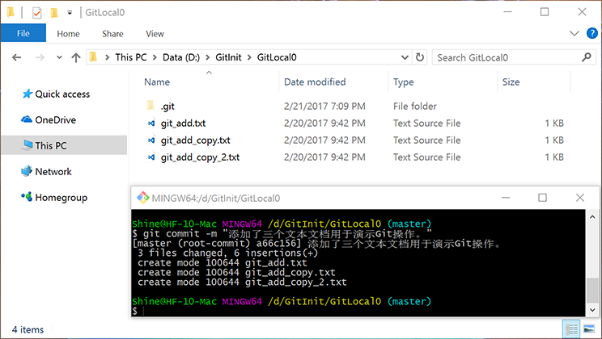

## 查看变更的文件：git status

``` bash
git status
```

`git status`命令会列出当前所在的分支，发生变更的文件，以及相关提示。


## 添加文件至缓存区：git add

### 添加一个文件

``` bash
git add <filename>
```

`git add`命令会将指定的文件的**当前状态**添加到**暂存区**中。注意这里的**暂存区**与**本地仓库**不是同一个位置。如果与SVN类比，相当于提交过程中对文件的勾选。**只有暂存的文件会在后续的提交中被提交。**


1. 上述过程创建了内容为*git add test*的txt文本文档。

2. 使用`git status`表示其为`untracked`，即未被版本控制追踪。

3. 使用`git add`将其添加至缓存区后可以在`git status`中观察到其状态为`Changes to be committed`，即将被提交的变更。

4. 再次修改这个文件，可以看到文件即被缓存，又被修改。首先暂存区只会暂存执行`git add`命令时的文件状态，**后续的修改并不会被自动暂存，也不会被后续的提交操作提交。**

5. 若要将新的变更添加到缓存区，只需再次运行`git add`命令即可。

### 添加所有未被追踪的文件

``` bash
git add .
```


## 将文件移出暂存区：git rm --cached

``` bash
git rm --cached <filename>
```

`git rm`命令会移除**暂存区**中指定的文件。不会对文件进行修改。

如果文件在暂存后再次被编辑，需要添加`-f`强制执行参数。`git rm -f --cached`。同样，命令仅仅会将文件从暂存区移除，文件的编辑结果不会丢失。

## 提交 git commit

``` bash
git commit -m "提交信息"
```

`git commit`会将暂存区里的数据提交到**本地仓库**。省略`-m`参数会调用Vim工具编辑提交信息。



## 查看提交历史

``` bash
git log
```

图中`a66c1569559..`是版本提交的记录，默认情况下取其**前7位**进行展示，即`a66c156`。


