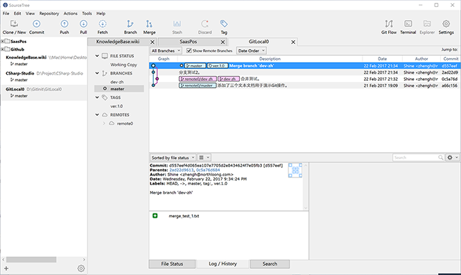
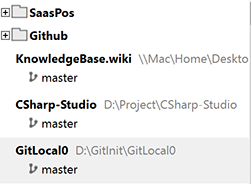
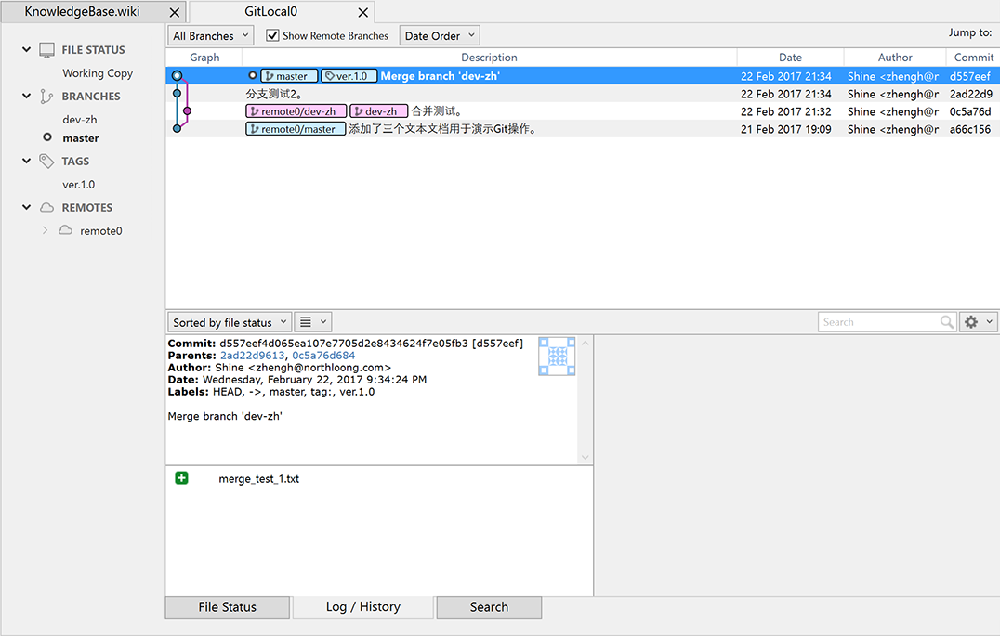
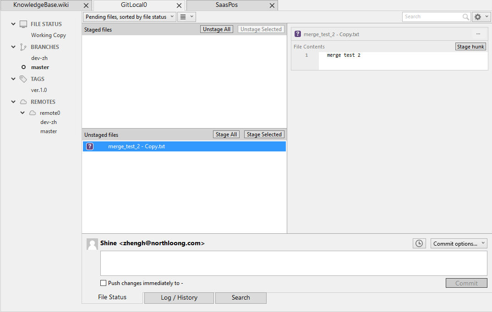

GUI可以直观的展现出Git仓库的各种状态以及命令。但需要一定的Git基础才能熟练运用。

Git For Windows默认会安装一个精简版的Git GUI工具。如果想追求更好的使用体验，不妨试试SourceTree。如果想尝试其他GUI，[这里](https://git-scm.com/downloads/guis)提供了一个Git GUI的列表。

[SourceTree](https://www.sourcetreeapp.com/)是[Atlassian](https://www.atlassian.com/)公司发行的一款免费Git GUI工具，跨Windows，Mac两个平台。

------

## 界面

主界面：

工程列表：这里用于展示和选择本地的Git仓库，可以通过拖拽初始化好的Git本地仓库进行添加。

Git命令工具栏：这里陈列了Git常用的命令集合。所有的命令式基于工作区中的本地仓库进行操作的。（SourceTree确实存在一些误导人的UI设计。）

扩展工具栏：
* `Terminal`可以快速的在Git Bash中打开工程所在文件夹，
* `Explorer`可以快速在文件资源管理器中定位该文件。
* `Setting`可以配置当前工程的远端，还可以对当前工程的配置进行修改。

工作区：
* 上侧的页签用来切换不同的工程。
* 下侧的页签用于切换当前工程的不同功能。
* 左侧可以看到本地的分支、标签、远端仓库以及远端标签。
* 合并代码时，只需要在某个提交记录上右键，点击合并即可。

------

