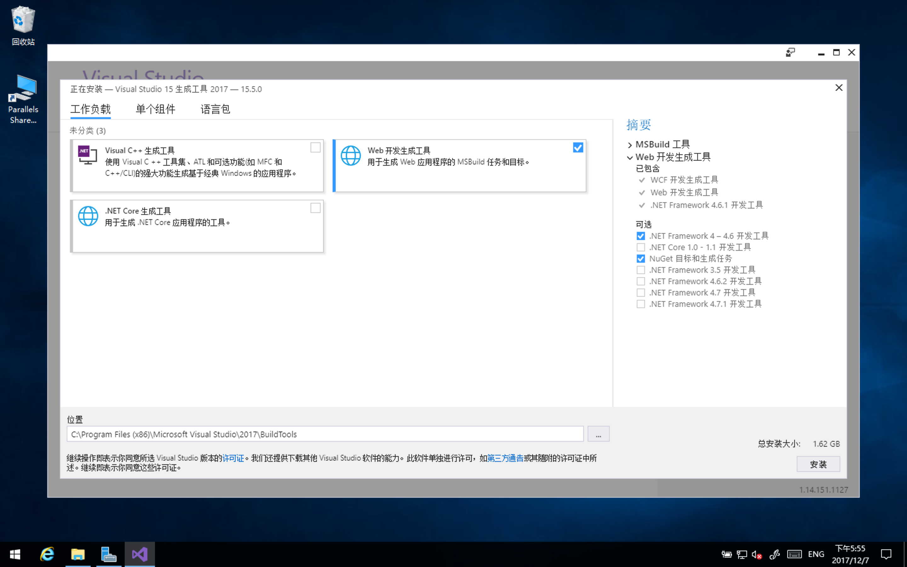

> The Microsoft Build Engine is a platform for building applications. This engine, which is also known as MSBuild, provides an XML schema for a project file that controls how the build platform processes and builds software. Visual Studio uses MSBuild, but it doesn't depend on Visual Studio. By invoking msbuild.exe on your project or solution file, you can orchestrate and build products in environments where Visual Studio isn't installed.
> 微软构建引擎，即MSBuild，是应用程序的构建平台。MSbuild提供了一种用来描述工程的XML纲要，用来声明使用的编译工具及编译过程。MSBuild不依赖于Visual Studio，相反Visual Studio需要MSBuild才能进行构建。在未安装Visual Studio的环境中，通过调用MSBuild.exe并指明具体的工程或解决方案文件，即可对产品进行编译及构建。
> ——摘自[Microsoft Offical Document](https://docs.microsoft.com/en-us/visualstudio/msbuild/msbuild)
 
> MSBuild is now available as part of the .NET Core SDK and can build .NET Core projects on Windows, macOS, and Linux.
> MSBuild现已成为.NET CORE SDK的组件，并且可以在Windows、macOS及Linux平台构建**.NET CORE**工程。
> ——摘自[What's New in MSBuild 15](https://docs.microsoft.com/en-us/visualstudio/msbuild/what-s-new-in-msbuild-15-0)

# MSBuild的版本及路径
* 早期的MSbuild的通常随.NET SDK一同安装在在**程序集全局缓存Global Assembly Cache**下，其路径为:`C:\Windows\Microsoft.NET\<架构>\<version>\MSBuild.exe`。

* 后续的MSBuild通常随Visual Studio一同发布，其路径被合并至Visual Stuio的安装路径中，例如VS2017中的MSBuild路径为：`C:\Program Files (x86)\Microsoft Visual Studio\2017\Enterprise\MSBuild\15.0\Bin`

# MSbuild without Visual Studio
MSBuild Tool 2017：[下载地址](https://www.visualstudio.com/thank-you-downloading-visual-studio/?sku=BuildTools&rel=15)

# MSBuild常用参数
|编译开关|缩略形式|说明|
|----|----|----|
|/help|/? or /h|显示可用的帮助信息. 例:  `msbuild.exe /?`|
|/maxcpucount[:`number`]|/m[:`number`]|显示构建时同时使用的CPU个数的最大值。不附加此标识时默认值为1，附加此标识且不指定数目时，MSBuild将尽可能多的使用CPU核心运行。更多信息请参阅[并行编译多个工程](https://docs.microsoft.com/en-us/visualstudio/msbuild/building-multiple-projects-in-parallel-with-msbuild). 下面的例子表示MSBuild将同时使用三个进程实现三个工程同时编译的效果。 `msbuild myproject.proj /maxcpucount:3`|
|/property:`name`=`value`|/p:`name`=`value`|设置或重写工程级别的属性，其形式为`name`:`value`键值对。多个键值对需要分开声明，或者使用分号或者逗号隔开。例如:  `/property:WarningLevel=2;OutDir=bin\Release;Configuration=Release`|
|/toolsversion:`version`|/tv:`version`|用来制定构建构成时使用的工具集版本。例如: `/toolsversion:3.5`  特别注意：工具集版本号不与工程的目标平台不能等同而视，目标平台指工程构建后运行的.NET Framework平台。|
|/verbosity:`level`|/v:`level`|  可选的信息量参数如下: 安静`q[uiet]`, 最小输出`m[inimal]`, 普通`n[ormal]`, 详细`d[etailed]`, and 诊断`diag[nostic]`.  例如: `/verbosity:quiet`|
|/nologo||不显示MSBuild的启动信息|
有关构建参数的详细文档在[这里](https://docs.microsoft.com/en-us/visualstudio/msbuild/msbuild-command-line-reference)。

# 安装示例

